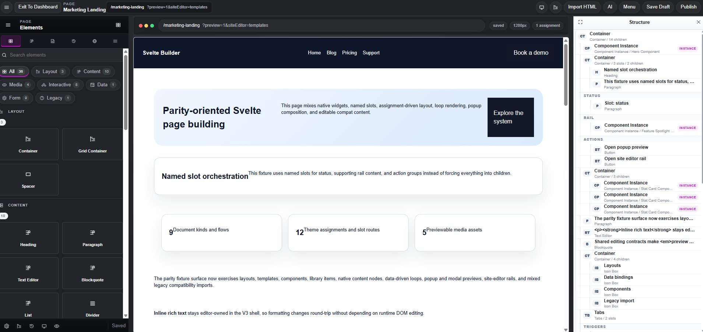
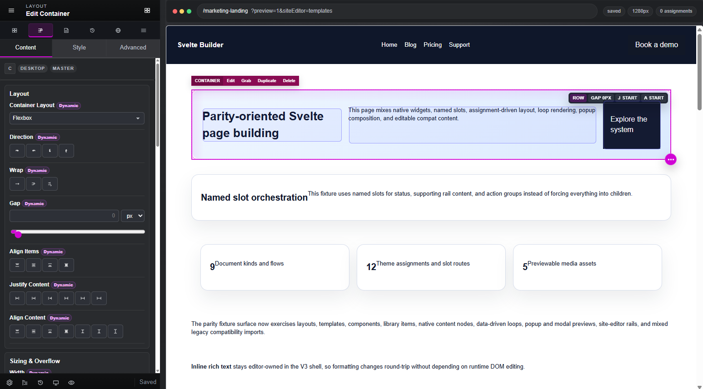
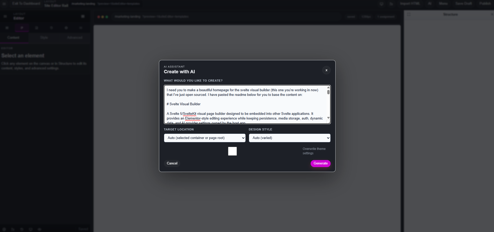
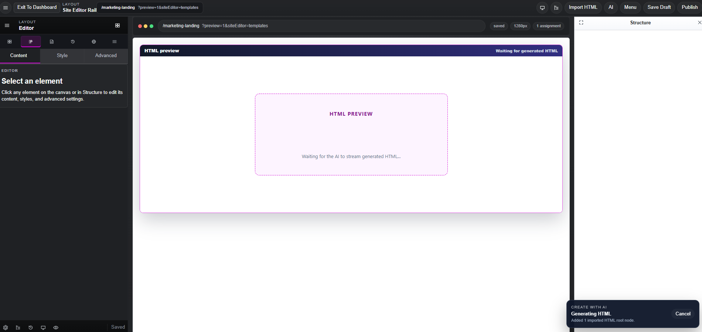

# Svelte Visual Builder

Version 0.2.8

A Svelte 5/SvelteKit visual page builder designed to be embedded into other Svelte applications. It provides an Elementor-style editing experience while keeping persistence, media storage, auth, dynamic data, and AI provider settings owned by the host app.

## Highlights

- Visual drag-and-drop editor with canvas selection, action rails, structure navigator, inspector panels, undo/redo, copy/paste, and paste-style support.
- Svelte runtime renderer for published pages, with editor-only code kept separate from runtime-only routes.
- Host-first SDK contracts for persistence, media, permissions, dynamic data, AI settings, and lifecycle hooks.
- Template import for native Builder package JSON and Elementor JSON.
- HTML/CSS import that converts common markup into editable Builder nodes and preserves complex markup as safe HTML fallback nodes.
- AI create/edit workflow with OpenAI-compatible provider settings, debug mode, HTML-based creation, and safer semantic editing tools.
- Dynamic data bindings for text, rich text, URLs, media, colors/styles, numbers, attributes, visibility, and host-provided providers.
- Media library contracts and reference upload/select flows.
- Draft, autosave, publish, revision, and restore contracts with reference SvelteKit behavior.
- Dense document and drag/reorder testing, including 200/500-node fixtures.

## Latest Changes

### Version 0.2.8 - 2026-05-01

- Overhauled the non-canvas shell areas with a dark-native visual system across Page Settings, History, Menu, and Globals.
- Moved complex Menu management into a full-workspace view so documents, presets, assignments, components, site entries, and import diagnostics have enough room.
- Added footer undo/redo controls and simplified redundant shell header/footer icons.
- Added collapsed-sidebar preview mode that expands the canvas, hides editor selection chrome, and disables preview hyperlinks to prevent accidental navigation.
- Added Border Radius controls for `Container` and `Grid Container`.
- Tightened container Sizing & Overflow controls by replacing range sliders with compact value/unit inputs.
- Tightened Position & Layer controls with one grouped Offset control for Top, Right, Bottom, and Left plus compact slider-free Z-Index editing.
- Removed remaining low-value numeric sliders from Gap, Width, Max Width, Min Height, Order, transition/animation duration, and Perspective controls.
- Added dropdown controls for animation presets plus background position and background size.
- Added muted placeholders for inherited/default margin and padding values so empty spacing inputs still communicate the effective canvas value.
- Improved responsive visibility controls with inline desktop/tablet/mobile toggles and authoring-mode hidden nodes that stay selectable while preview/live output hides them.
- Tightened the Structure navigator indentation by removing redundant element abbreviation badges.
- Replaced the reference studio seed with the full exported open-source homepage fixture and updated the demo header/CTA links for GitHub and docs.
- Fixed dark-panel loading states, white gutters, shell tab drift, and select/dropdown readability.
- Fixed collapsed preview mode so hidden nodes and empty "Drop items" placeholders do not appear, and removed default runtime gaps between header, page, and footer slots.

### Version 0.2.7 - 2026-04-30

- Expanded host SDK, plugin API, and adapter contracts for richer runtime/editor integration points.
- Improved AI editing flows and tool coverage, with broader tests around AI creation and editing behavior.
- Added runtime component forwarding coverage so custom Svelte runtime components receive builder attributes, class names, styles, props, and children consistently.
- Added Template Library export actions for saved library items.
- Added Template Library support for saving the full current page as a reusable page template, separate from saving only the current selection.
- Improved Globals panel routing for Classes, Variables, Components, and Library so the highlighted tab and rendered management view stay in sync.
- Fixed canvas selection after template import so clicking a node returns the left panel to editing controls instead of leaving the Library view stuck open.
- Fixed the top-right responsive selector so tablet/mobile editing can reopen the responsive controls and return to desktop mode.
- Updated reference studio bundle budgets for the current deferred editor and CSS output.

### Version 0.2.6 - 2026-04-30

- Fixed margin and padding dimension controls so unlinking equal side values stays unlinked instead of collapsing back into a linked shorthand.
- Preserved valid CSS output by serializing explicitly unlinked equal sides as four-value box shorthand.
- Added regression coverage for parsing and serializing unlinked matching dimension values.

### Version 0.2.5 - 2026-04-30

- Smoothed drag-and-drop from the Elements panel into the canvas with more forgiving insertion hit zones and steadier target resolution.
- `Container` and `Grid Container` now use the same visible before/after insertion bands as content elements when dropped between children, while still supporting intentional inside drops.
- Added selective `@dnd-kit/svelte` droppable regions for stable canvas, slot, empty-container, and navigator targets, with the custom builder resolver remaining the final authority.
- Improved drag start reliability from palette tiles, preserved click-to-insert, and made inside-vs-before-vs-after feedback clearer.
- Added unit and Playwright coverage for container drops into filled containers, visible insertion bands, empty-container drops, drag overlays, and click-to-insert behavior.

### Version 0.2.0 - 2026-04-29

- Added [full builder documentation](docs/builder-documentation.md) with end-to-end architecture, schema, SDK, runtime, SvelteKit, import, media, AI, extension, and troubleshooting details.
- Added a [changelog](CHANGELOG.md) with semantic versioning rules and release notes.
- Expanded the [SDK embedding guide](docs/sdk-embedding.md) with host extension and runtime component integration details.
- Bumped the root workspace, reference apps, and all builder package manifests to `0.2.0`.

## Screenshots

### Main Builder

The reference studio includes the full editing shell: canvas preview, left inspector, structure navigator, responsive/status controls, import tools, AI actions, draft/publish states, and host-owned page context.



[Watch the simple editing workflow demo](https://youtu.be/ins4jXH2U3U)

### Container Controls

Selected containers expose compact canvas controls, layout context, action rails, and resize/layout affordances without requiring the user to leave the visual surface.



### Create With AI

The AI create dialog accepts a prompt, target location, style preference, theme options, and expandable context before generating HTML/CSS through an OpenAI-compatible provider.



### Streaming AI Preview

While AI is generating, the full dialog collapses to a compact progress window and the canvas shows an HTML preview placeholder/stand-in for streamed output before it is parsed into editable Builder nodes.



[Watch the Create with AI realtime preview demo](https://youtu.be/6cGpdJaJ2xw)

## Workspace

This is a pnpm monorepo.

```text
apps/
  reference-studio     Demo/editor development app
  embed-smoke-host     Minimal host app proving public SDK embedding

packages/
  schema               Project, document, node, style, media, and revision schemas
  core                 Editor engine, mutations, history, selection, persistence state
  plugin-api           Element registry, controls, default widget definitions
  runtime-svelte       Published/runtime rendering and CSS compilation
  editor-svelte        Svelte editor UI, controller, import, AI, media, SDK helpers
  elementor-import     Elementor JSON conversion
  adapter-sveltekit    SvelteKit integration helpers
```

The reference studio ships with an open-source homepage fixture at `apps/reference-studio/src/lib/server/fixtures/deepseek-homepage.builder.json`, wired as the default `/` page in the demo seed.

## Getting Started

Install dependencies:

```bash
pnpm install
```

Run the reference studio:

```bash
pnpm dev
```

Run checks and tests:

```bash
pnpm check
pnpm test
pnpm test:e2e
```

Run the embedding validation gate:

```bash
pnpm embed:validate
```

## Documentation

| Guide | Purpose |
| --- | --- |
| [Full Builder Documentation](docs/builder-documentation.md) | End-to-end feature, architecture, schema, SDK, runtime, import, AI, and API reference. |
| [SDK Embedding Guide](docs/sdk-embedding.md) | Focused production embedding guide for Svelte/SvelteKit hosts. |

## Embedding In A Svelte App

Host apps should import from package roots only:

```ts
import { BuilderCanvas, createBuilderHostSdk } from '@builder/editor-svelte';
import { BuilderRenderer, renderPublishedDocument } from '@builder/runtime-svelte';
import { createSvelteKitBuilderIntegration } from '@builder/adapter-sveltekit';
import { createBuilderHostAdapter } from '@builder/plugin-api';
```

Do not import internal files such as `@builder/editor-svelte/src/lib/...`.

The host app owns:

- project loading and saving,
- autosave, drafts, publish, revisions, and restore,
- media upload/storage/CDN URLs,
- authorization and permissions,
- dynamic provider data,
- AI settings and API keys.

See [docs/builder-documentation.md](docs/builder-documentation.md) for the full end-to-end documentation and [docs/sdk-embedding.md](docs/sdk-embedding.md) for the focused embedding guide.

## Import Features

### Template Library

The Globals Library can import native Builder JSON and Elementor JSON templates, save the current selection as a reusable snippet, save the entire active page as a page template, export saved library items as `.builder.json`, and insert saved items back into the active page.

### Elementor JSON

The importer accepts Elementor-style JSON payloads and converts supported structures, widgets, layout, spacing, backgrounds, borders, responsive styles, hover states, IDs, classes, media references, and diagnostics into Builder documents.

Unsupported but visually important styles are preserved where possible as scoped custom CSS, with warnings/parity gaps surfaced to the user.

### HTML/CSS

The HTML importer accepts full HTML documents or fragments, extracts style blocks and inline styles, scopes imported CSS, and converts common tags into editable Builder nodes:

- containers: `main`, `section`, `article`, `header`, `footer`, `nav`, `div`
- text: `h1`-`h6`, `p`
- media: `img`
- buttons/links where detectable
- fallback `html` nodes for complex or unknown markup

## AI Assistant

The AI assistant supports OpenAI-compatible `/chat/completions` endpoints, including custom endpoints such as OpenRouter, Gemini-compatible gateways, local providers, and OpenAI-compatible proxies.

Current AI flows:

- **Create with AI:** generate semantic HTML/CSS, parse through the HTML importer, then insert valid Builder nodes.
- **Edit with AI:** use safer semantic tools for targeted changes.
- **Debug mode:** inspect prompts, request payload summaries, returned HTML/CSS, parsed nodes, diagnostics, tool calls, normalized arguments, and mutation summaries.

API keys are stored through the configured host/browser settings adapter and are not saved into project JSON.

## Dynamic Data

Dynamic values can drive:

- content and rich text,
- links and attributes,
- images/media,
- colors and style values,
- numbers and booleans,
- gallery/object-like values,
- visibility conditions.

The builder ships host-agnostic provider definitions inspired by common CMS/site/product fields. Real data resolution stays in the host adapter.

## Production Readiness

Use `apps/embed-smoke-host` as the confidence fixture for real integrations. It demonstrates:

- public package-root imports,
- host-owned persistence endpoints,
- host-owned media endpoints,
- permissions,
- dynamic preview context,
- AI settings,
- editor route,
- runtime-only published route.

Before embedding in a production app:

- run `pnpm embed:validate`,
- verify runtime-only pages do not load editor chunks,
- enforce permissions server-side as well as in the UI,
- keep credentials and API keys outside project JSON,
- connect persistence/media adapters to the host backend,
- review bundle budgets for editor and runtime routes.

## Notes

- This repository intentionally ignores local runtime logs, generated test results, dependency folders, and the large Elementor reference mirror.
- The first production consumption path is workspace packages. Public package-root exports are the stable integration surface.
